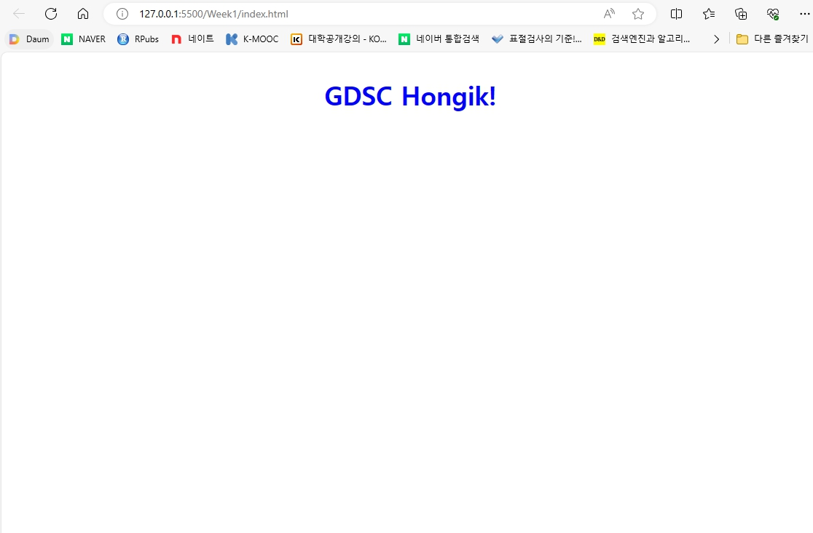

2024-1-Web-Study WIL1
============================

* ## CSS 개요
    * ### CSS(Cascading Style Sheet)
        * 문서의 레이아웃, 글꼴 등 시각적 요소들로 표현되는 문서의 디자인을 분리하기 위해 만들어진 Style sheet 언어
    * ### CSS 문법
        * CSS는 선택자와 규칙의 조합으로 구성된다.
        * 선택자(h1, p, img 등)으로 스타일을 적용할 요소를 선택한다.
        * 규칙에서 선택한 요소에 적용할 스타일을 정의한다.
        ```
        선택자 {
            속성: 값;
            속성: 값;
            ...
        }
        ```
    
    * ### CSS HTML 파일에 적용하기
        * 외부 스타일 시트로 적용하기
            * CSS 파일을 HTML 문서에서 불러와 사용하는 방법
            ```
            <head>
                <link href="style.css" rel="stylesheet">
            </head>
            ```
        * 내부 스타일 시트로 적용하기
            * HTML 파일 내부에서 `<style>` 태그를 이용하여 스타일을 적용하는 방법
            ```
            <head>
                <style>
                p {
                    color: red;
                }
                </style>
            <\head>
            <body>
            <\body>
            ```

* ## 과제 실행 결과
